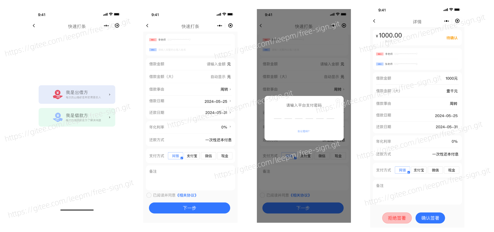
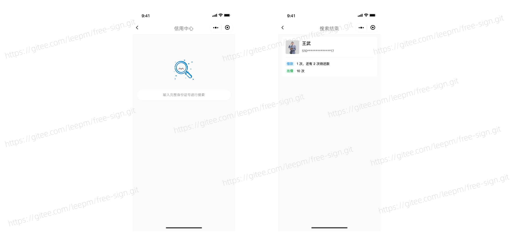
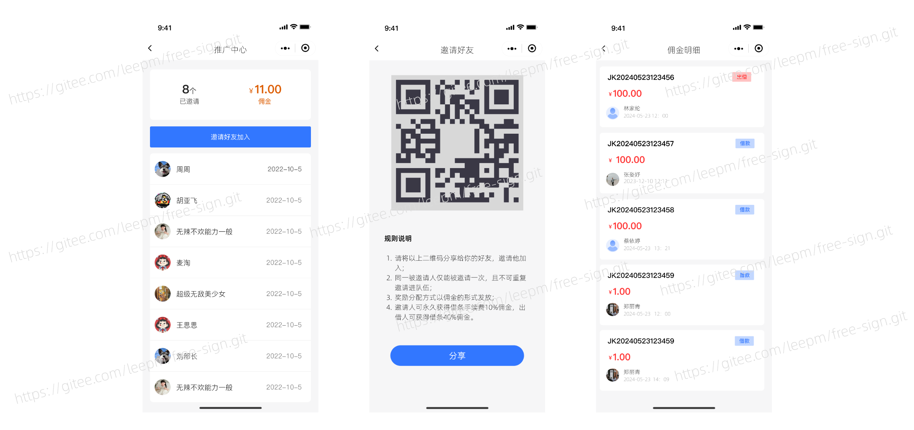

# Free Sign (Convenient Sign)

Current Latest Version: v1.0.5 (Release Date: 2025-04-29)

## Introduction

Free Sign – Your Electronic Contract Signing Expert, Safe, Efficient, and Easy Contract Management

Free Sign is an innovative online electronic contract signing product that offers you a safe and efficient signing experience. We understand that contract signing is not only about the rights and obligations of both parties but also a **transfer of trust**. Therefore, we have integrated a series of financial-grade security features such as **facial recognition and ID verification** to ensure that every signing is genuine and reliable.

Free Sign also has four core functions: **Credit Center, Quick IOU, Online Customer Service, and Promoter Ambassador**. Through the Credit Center, you can easily check the credit records of the other party to provide a reliable reference for signing contracts; the Quick IOU function allows you to quickly initiate contracts and save valuable time; Online Customer Service is always available to answer your questions and ensure a smooth usage experience; and the Promoter Ambassador is a sharing platform that allows you to enjoy convenient services while bringing more users to the platform and sharing benefits.

## Applicable Business Scenarios

### Industries

- Financial Industry
- Personal Financial Industry

## Supported Business Ends

- Backend Management End
- Signing Mobile End

## Technical Architecture

### Development Architecture

- Language: Java 8+ (below 17), Vue2.0
- IDE (JAVA): IDEA (must install lombok plugin)
- IDE (Frontend): Vscode, HBuilder
- Dependency Management: Maven (backend), npm (frontend)
- Cache: Redis
- Database Script: MySQL

### Backend

- Basic Framework: Spring Boot
- Persistence Framework: Mybatis
- Security Framework: Apache Shiro 1.10.0, Jwt 3.11.0
- Others: fastjson, poi, Swagger-ui, quartz, lombok (simplify code), etc.

### Frontend

| Description | Framework | Description | Framework |
| ----------- | --------- | ----------- | --------- |
| Basic Framework | element-ui | JS Version | ES6 |
| Basic JS Framework | Vue.js | State Management | Vuex |
| CSS Preprocessing | scss | | |

## Product Screenshots

### 1. Home Page

> Users need to sign an automatic authorization agreement before signing a contract.

### 2. Initiate Signing

### 3. Contract Status

> Different contract statuses are available based on various business scenarios, such as: Pending Confirmation, Rejected, Overdue, In Repayment, etc.

### 4. Real Name Authentication and ID Verification

> Automatic authorization agreements and contract information can be sent to both parties via email.

### 5. Contract Information (IOU)

> Unified contract management allows filtering of contracts based on different statuses.

### 6. Credit Center

> Credit information and contract signing records of contract signatories can be viewed on the platform based on name and ID number.

### 7. Promotion Center

> Users can earn commissions by inviting friends. When the commission reaches a certain amount, it can be withdrawn and used to offset contract signing fees.

### 8. Personal Center

> Users can view withdrawable balances, apply for withdrawals, cancel or confirm automatic authorization signing agreements, and provide feedback to the platform at any time.

### 9. Backend Withdrawal

> After users apply for withdrawal on the app, administrators can process the withdrawal in the backend.

If you have any ideas, suggestions, or business合作 needs regarding the Free Sign product, please scan the QR code to contact the Free Sign project team:

## Give Us a Like

If you think it's good, please Watching, Starred, Fork ☺