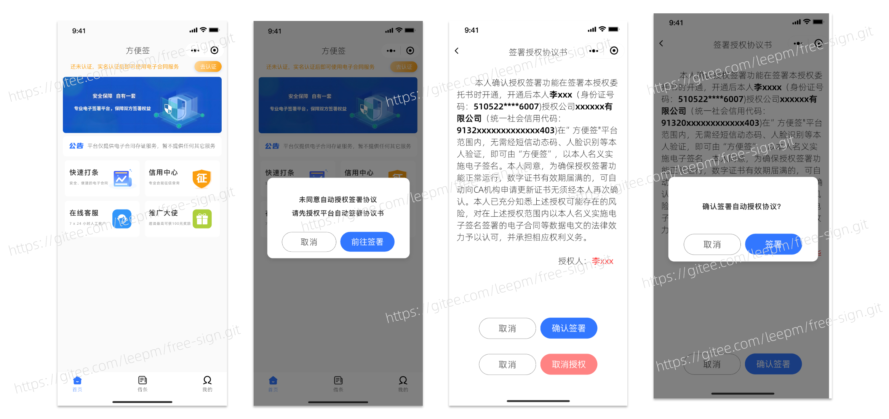
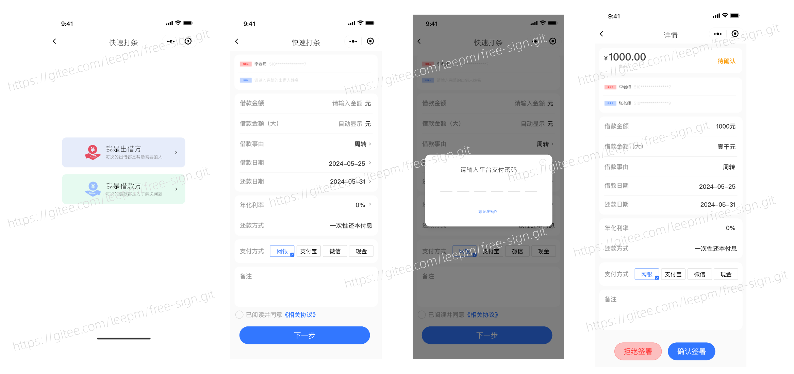
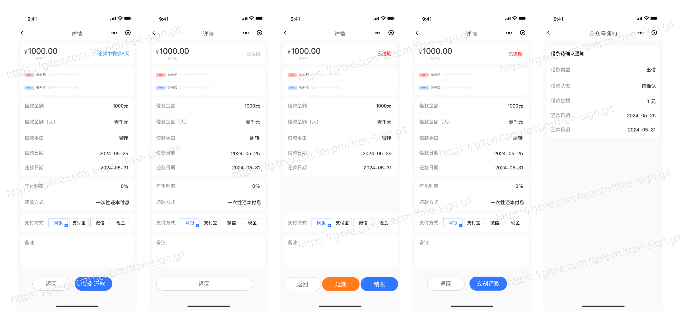
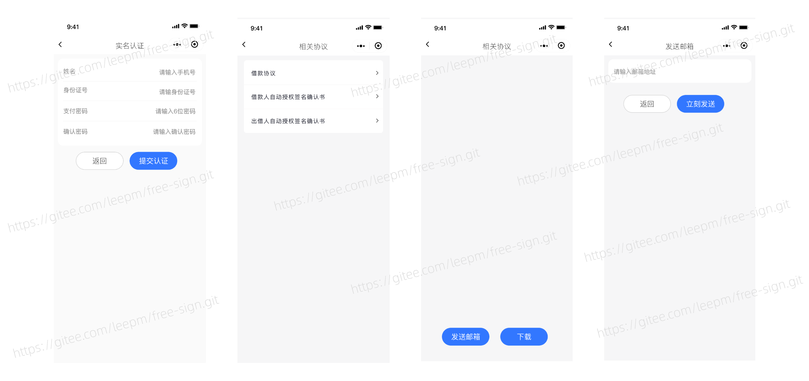
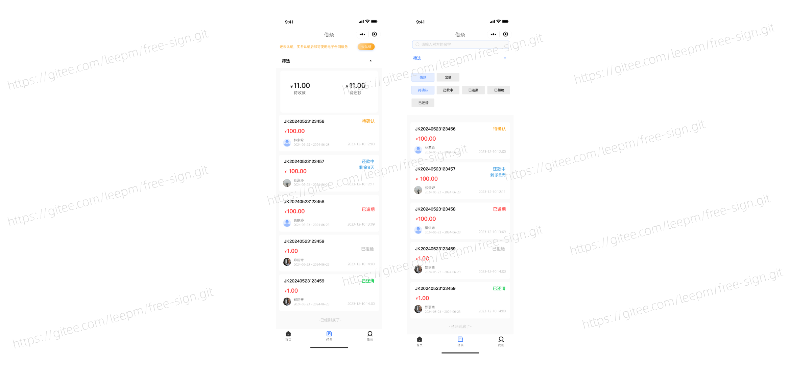
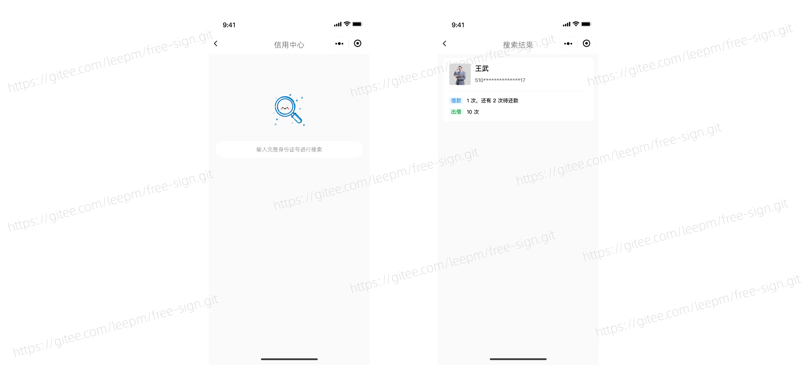
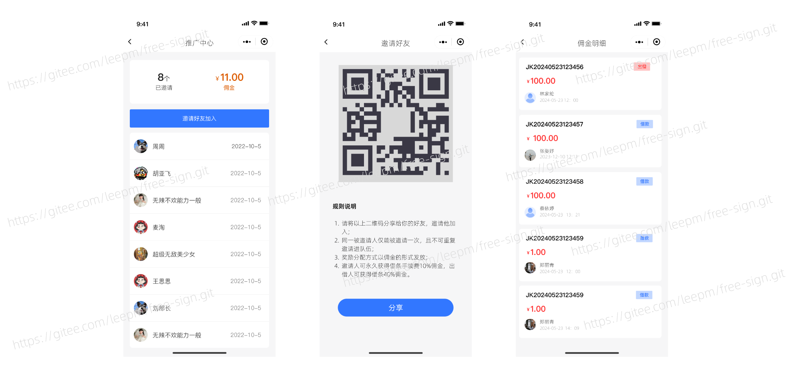
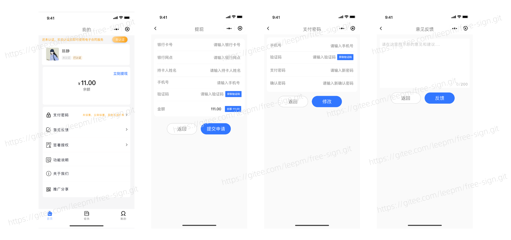
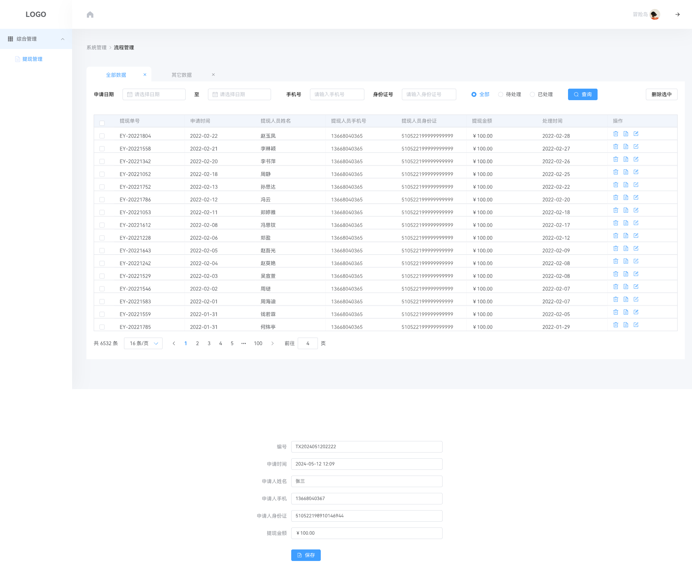

# 免费电子签(方便签)

当前最新版本：v1.0.5 (发布时间：2025-04-29)

#### 介绍

方便签——您的电子合同签署专家，安全、高效、轻松管理合同事务

方便签是一款创新的在线电子合同签署产品，为您提供安全、高效的签署体验。我们深知，合同签署不仅关乎双方权益，更是一种信任的传递。因此，我们集成了一系列金融级安全功能，如**人脸识别、人证对比**等，确保每一次签署都真实可靠。

方便签还拥有四大核心功能：**信用中心、快速打条、在线客户和推广大使**。通过信用中心，您可以轻松查询对方的信用记录，为签署合同提供有力参考；快速打条功能则让您能迅速发起合同，节省宝贵时间；在线客户随时为您解答疑问，确保您在使用过程中畅通无阻；而推广大使则是一个分享平台，让您在享受便捷服务的同时，也能为平台带来更多用户，共享收益。

## 适用业务场景

#### 行业 

- 金融行业
- 个人金融行业

## 支持业务端

- 后台管理端
- 签署移动端

## 技术架构

### 开发架构

- 语言：Java 8+ (小于17)，Vue2.0
- IDE(JAVA)： IDEA (必须安装lombok插件 )
- IDE(前端)： Vscode、HBuilder
- 依赖管理：Maven（后端）、npm（前端）
- 缓存：Redis
- 数据库脚本：MySQL

###   **后端**

- 基础框架：Spring Boot

- 持久层框架：Mybatis

- 安全框架：Apache Shiro 1.10.0，Jwt 3.11.0
- 其他：fastjson，poi，Swagger-ui，quartz, lombok（简化代码）等。

### 前端

#### 前端框架

| 说明       | 框架       | 说明     | 框架 |
| ---------- | ---------- | -------- | ---- |
| 基础框架   | element-ui | JS版本   | ES6  |
| 基础JS框架 | Vue.js     | 状态管理 | Vuex |
| css预处理  | scss       |          |      |

## 产品效果图

##### 1、首页

> 用户在签署合同的时候需要先签署自动授权协议

##### 2、发起签署

> 

##### 3、合同状态

> 根据不同的业务情况有相应的合同状态，如：待确认、已拒绝、已逾期、还款中等合同状态

##### 4、实名认证、人证对比

> 自动授权协议和合同信息可通过邮箱发送至双方签署人处

##### 5、合同信息（打条）

> 统一的合同管理，可根据不同状态进行合同的筛选

##### 6、信用中心

> 根据姓名、身份证号可以在平台当中查看到合同签署人的信用信息和签署合同的次数

##### 7、推广中心

> 用户可通过邀请好友获得相应的佣金，当佣金达到一定数额之后可申请提现，同时这部分的推广佣金可用于抵消合同签署的打条费用

##### 8、个人中心

> 用户可查看到自己可提现的余额、可申请提现、同时也可以取消自动授权签署协议和确认自动签署协议，同时用户可随时与平台进行反馈。

##### 9、后台提现

> 当用户在小程序app申请提现之后管理人员可以在后台进行提现操作。

如果你有任何对 free-sign 产品上的想法、意见或建议，或商务上的合作需求，请扫码添加 free-sign 项目团队进一步沟通： 

##  给个鼓励

如果觉得还不错，请 Watching，Starred，Fork 吧 ☺
